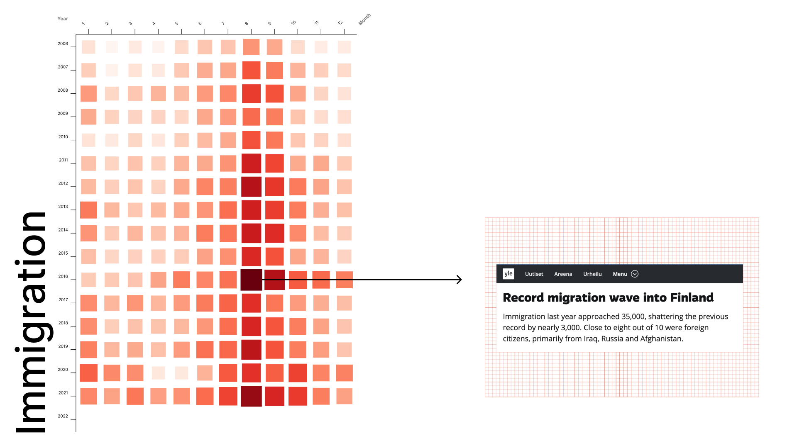
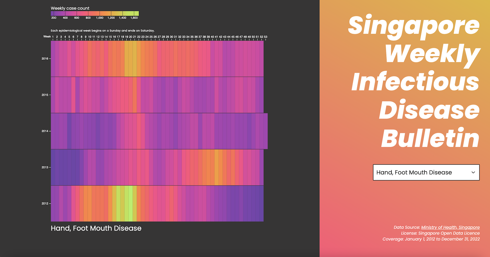
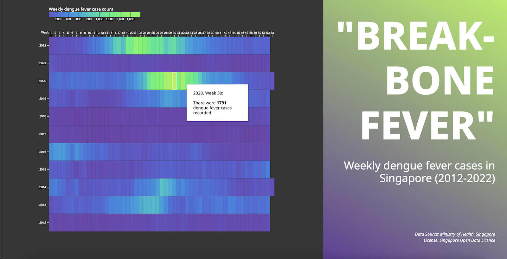
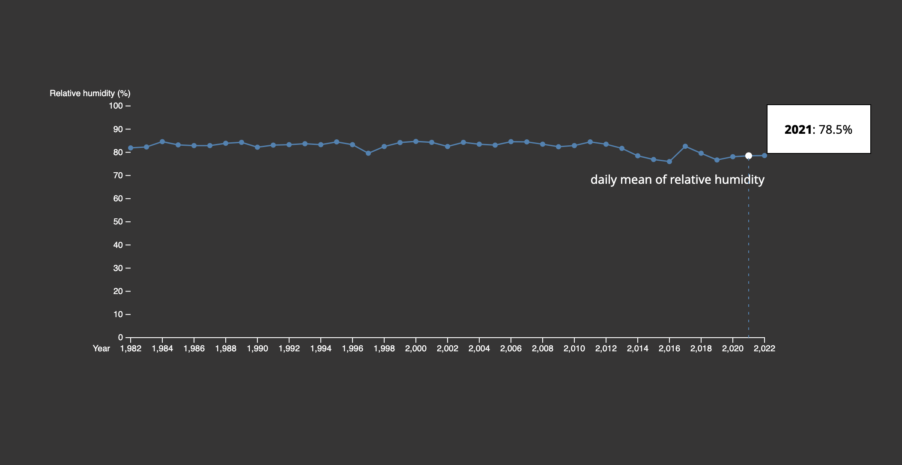

*on visualising & intepreting the data*

## 2022: The Job Seeking Flunctuations in Nursing (in Finland)

Since a service design project for Finnish emmigrants' returning experience, I have started paying attention to the topic of immigration in the following projects during my study or in everyday life. For example, in an introductory course of Information Design, when I was investigating a dataset about the monthly number of jobseekers and vacancies in the Healthcare sector in Finland, I noticed a possible link between jobseeking and the immigration: [Something you may Care: data behind careworker in Finland (Autumn 2022)](https://www.figma.com/proto/rKyJDHJ89ELLG81i1tmDuE/Information-Design?page-id=0%3A1&node-id=2-8&viewport=236%2C-267%2C0.21&scaling=contain&starting-point-node-id=2%3A8)

*Heatmap of immigration to Finland by month from January 2006 to December 2022*

## 2023: The Weekly Infectious Disease Case Count (in Singapore)

Here is a heatmap depicting the weekly infectious disease case count in Singapore from January 1, 2012 to December 31, 2022. ([interactive visualisation here](https://l-lu-u.github.io/singapore-weekly-infectious-disease-bulletin/))

At the beginning of the project, I was planning to map the dengue epidemic outbreaks with meteorological data, such as seasonal monsoons, humidity, or rainfall - as we understand that dengue is transmitted by Aedes species mosquitoes, which is often associated with weather conditions. ([trial version](https://l-lu-u.github.io/weekly-dengue-cases/))

*Heatmap of immigration to Finland by month from January 2006 to December 2022*

However, when looking at the periodical pattern of dengue outbreaks, I start wondering - was the year 2021 less humid than 2022 or 2020? The answer is - no (after I checked the open data from the National Environment Agency, Singapore). During this process, I unexpectedly learnt quite a few things about epidemiology - for example, how construction sites, Covid-19 lockdowns, vector control fundings… these socio-economic situations can impact on contagious disease outbreaks. 

Here is the very interesting thing I learnt about information design - it works more than the presentation of final outcomes, instead, it is often a means of inquiry. Beginning with visualising the information, I become curious about a phenomenon and start investigating more into it.