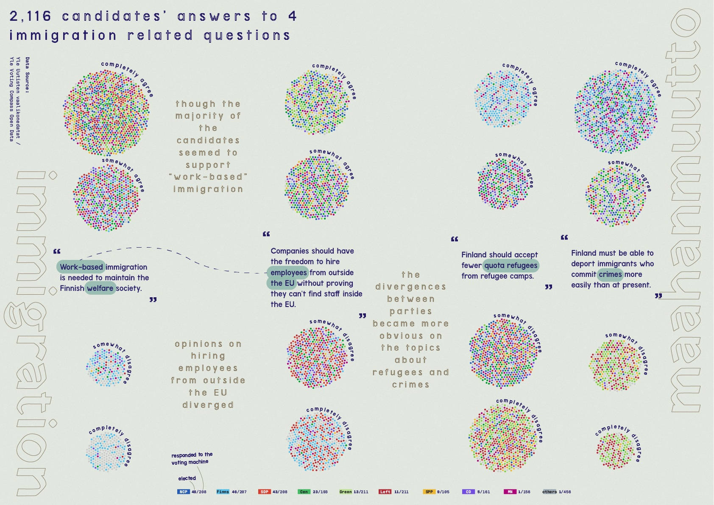
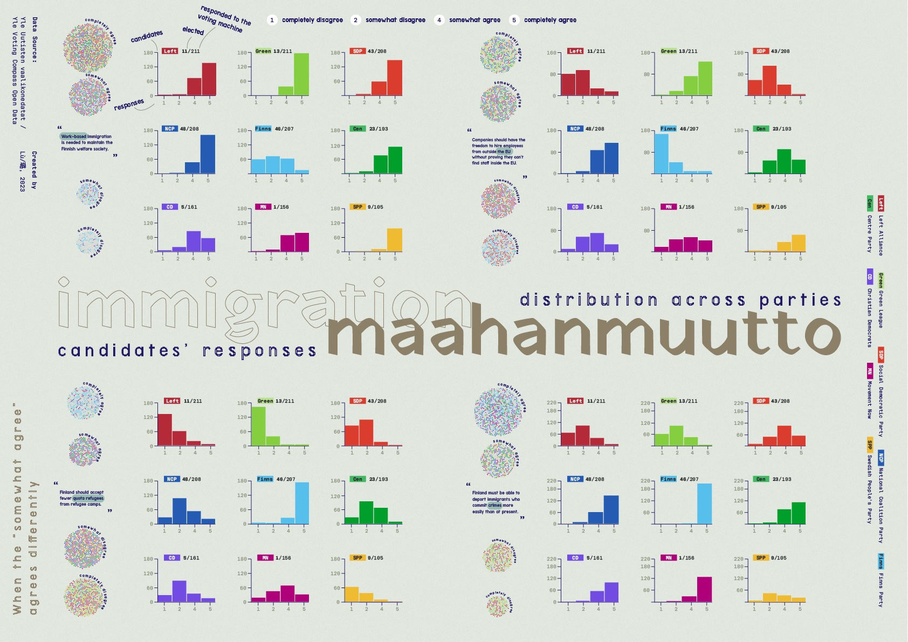

*This project was long-listed in Information is Beautiful Awards 2023*

During my minor study in Information Design (2023), I conducted a visualisation project on election parties and candidates' views on immigration on voting compass.

Data source: [Yle Uutisten vaalikonedatat / Yle News Voting Compass Data](https://yle.fi/aihe/artikkeli/2016/05/18/avoin-data-tarjolla-ylen-sisaltoja-ja-metatietoa#vaalikoneet)

*Candidates’ opinions on work-based immigration*

## Question: What are we talking about when talking about immigration?

From the parliamentary election in April to the new cabinet formation in mid-June, immigration policy has been one of the topical issues in 2023 Finnish government negotiation. How do Finnish election parties and their candidates view immigration? What are the major conflicts between parties?

With access to the open data from the Yle voting compass, this information design project attempts to unpack the complex discussion topics about immigration and remind us of some potential cognitive biases. 

*Candidates’ opinions on 4 immigration-related statements*

*Candidates’ opinions and the distribution within and across parties*

## A qualitative analysis

Regarding the questions of the voting compass, political parties also provided short answers to elaborate their views. Based on the textual content, I also conducted a preliminary qualitative analysis to identify the possible recurring themes. Below is a graph indicating the themes and their frequencies.

*Frequent topics in parties’ political stances in immigration based on a qualitative analysis*

Here are some topics I have noticed throughout the process:

1. **”Skills & Talents”** are being used in justifications for both supporting and restricting immigration - some of the right wing parties claimed that “top talents will come on their own initiatives.”
2. **”Crime statistics”** has been frequently associated with the population with immigrant backgrounds, yet the unresolved case of ethnic profiling reminds us again of the structural racism against certain ethnic groups, especially towards Roma people.
3. One of the two major divergences is actually on “if everyone’s rights should be protected.” There are some far right parties emphasised on **“ethnic Finns”** and made a few open racist comments.

…While a pressing (and maybe fundamental) conflict is about - do we believe that the cultures and collective identities thrive in interactions? How shall we foster collective identities (without structural oppressions)?

## Limitations

The original data was in Finnish. Due to my limited proficiency, I used DeepL translator and with some help from my Finnish speaking friend.

Another limitation is my limited knowledge on political sciences. I do wish to learn more from immigration studies and collaborate with researchers from the relevant fields.