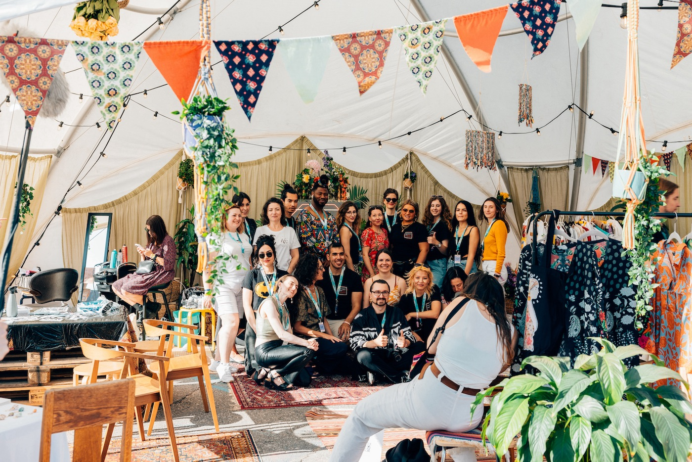
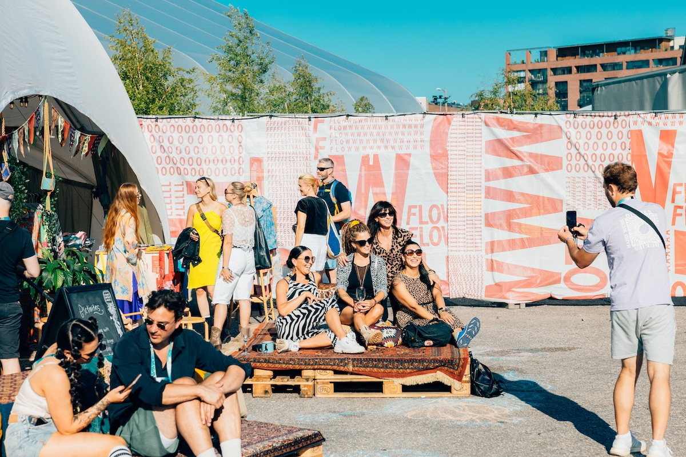
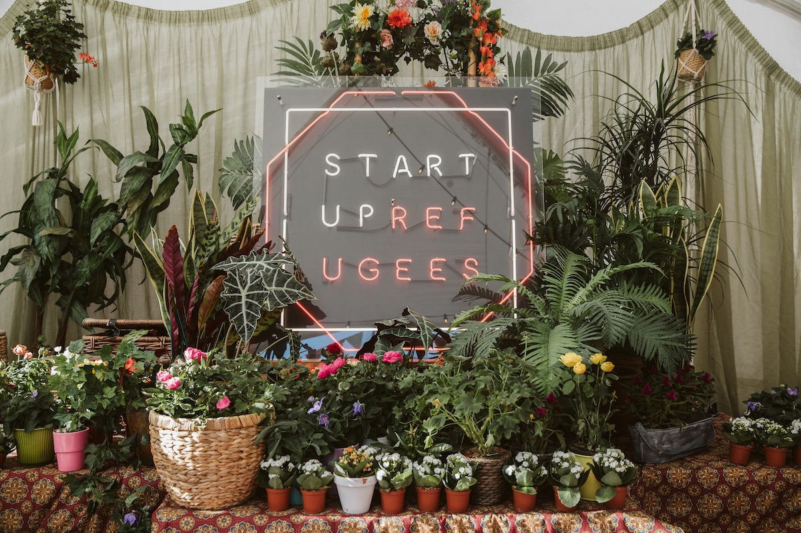

*visual & space design for the tent of Startup Refugees at Flow Festival 2023, together with Diana Lisitsa*

## 'Urban Oasis' found together

In 2023 summer, together with my friend (and my classmate) Diana Lisitsa, we worked with Startup Refugees - a Finland-based non-profit organization that supports refugees, asylum seekers, and other migrants in employment - to design their event space at Flow Festival. Inside the tent, there will be booths of entrepreneurs from Startup Refugees' programme.  

With the given concept "Urban Oasis," we wish to set up a refreshing and welcoming space so that the festival goers would like to visit the tent or rest around the space (or even take pictures with it).

To create the feeling of "warmth" and "softness," we utilised the drapes and rugs from the office, and fabricated eccentric bunting banners and scrap twines as additional decorations.

