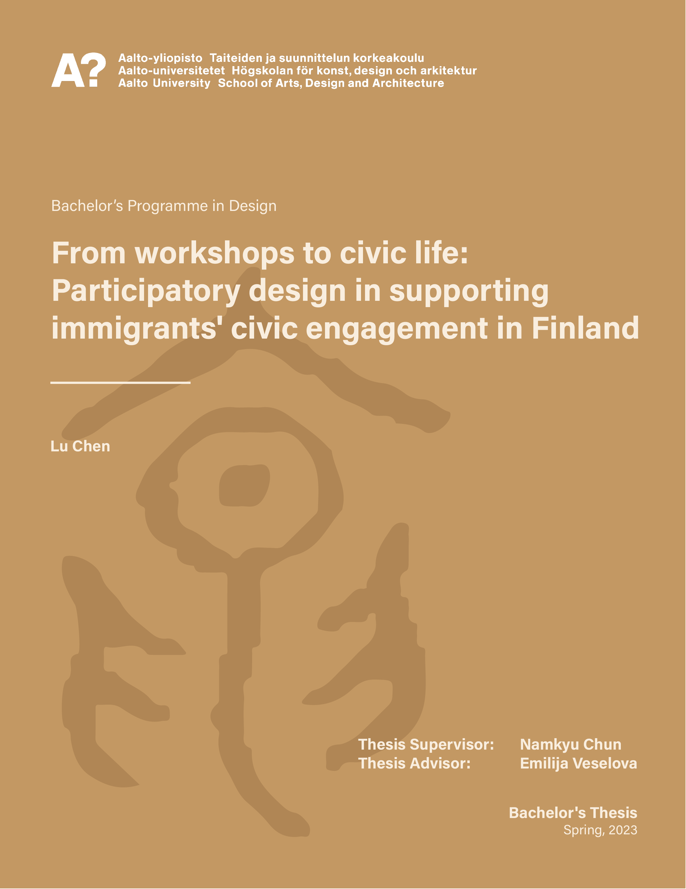

*thesis, participatory design in civic engagement*

## Question: How participatory design might facilitate immigrants' civic engagement (in Finland)?

During the spring of 2023, I graduated from the BA Design study with my thesis titled *“From Workshops to Civic Life: Participatory Design in Supporting Immigrants’ Civic Engagement in Finland.”* In this thesis, I aimed to investigate the roles of design and designers in supporting immigrants’ civic engagement in Finland. By interviewing 8 designers who had experiences working with public agencies and participants with immigrant backgrounds, I acquired an overview about the applications of design in public service development, as well as designers' challenges.

*>> From Workshops to Civic Life: Participatory Design in Supporting Immigrants’ Civic Engagement in Finland (2023) <<*

This work is publicly available on AaltoDoc, you may access it here: <https://urn.fi/URN:NBN:fi:aalto-202307094449>

One may ask: why does civic engagement matter for immigrants? And, after all, what does it mean by “civic engagement”? Integration is defined as an interactive development process that requires mutual accommodation from both the immigrants and the hosting society by the Finnish government. Within the present integration monitoring system, public participation has been assessed as a strong indicator of integration. Immigrants’ participation reflects one’s sense of belonging in the host society. The matter of ownership and the opportunities to realise one’s potential are fundamental for immigrants to become an integral part of the new environment. Thus, adequate opportunities for participation imply social cohesion between the immigrant population and the host society.

As a latent form of public participation, civic engagement refers to residents’ participation in improving community conditions. Conventionally, public participation is studied regarding electoral activities and membership associations. This thesis adopts an alternative angle to research the political dimensions of integration through participatory design.

The qualitative research consists of 8 semi-structured interviews with designers who have adopted participatory methods in public service or space development projects, where both immigrants and public agencies were stakeholders.

The outcome of this thesis constitutes an overview for designers who wish to advance immigrants’ civic engagement in Finland through participatory methods. Combining the interview findings with Manzini’s design modalities, I identified four layers of designers’ roles: 
1. the facilitator of collaboration, 
2. the trigger of change, 
3. an individual in the social fabric, and 
4. the interpreter of cultures.

## Reflection: Being Designers and Our Positionality

It seems that designers' role of "being an individual in the social fabric" is seldom discussed in the professional setting. Yet, we (designers) and the design subjects are often connected in various ways. During this thesis process, I reflected on my own experiences being a migrating person and how my experiences from elsewhere can possibly contribute to the discussions and design work in the Finnish context 🙌

## The Pattern on the Cover

The cover design is based on the character “与/與” (“together; to give”) in Chinese seal script. The seal script illustrated two persons feeding each other food with a spoon (possibly under a roof). As “participation” is translated as “参与/參與,” the character “与/與” aptly depicts the mutually supportive essence of collaborative and participatory design.

## Thanks to...

I would like to express my deepest gratitude to my supervisor Namkyu Chun and my advisor Emilija Veselova (she/her/they) for all the support and guidance in my first attempt to research into design.

This endeavour would not have been possible without the help of all the designers who participated in my expert interviews. The kind sharing of their own experience and reflections have greatly helped me to gain an in-depth understanding of the research topic.