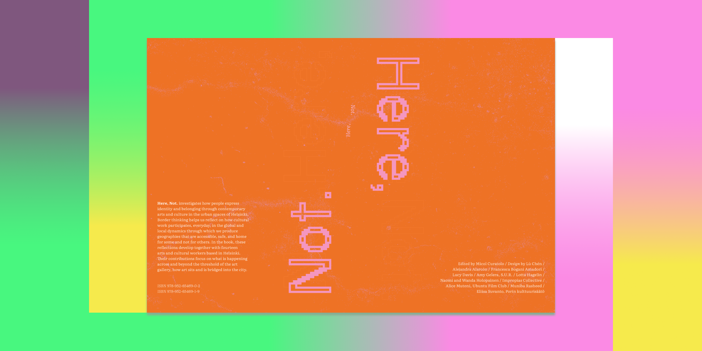
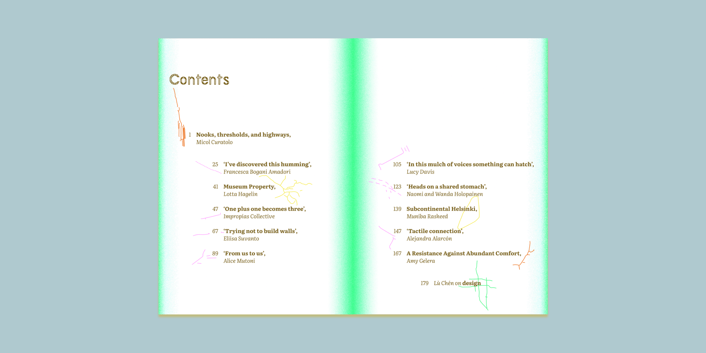
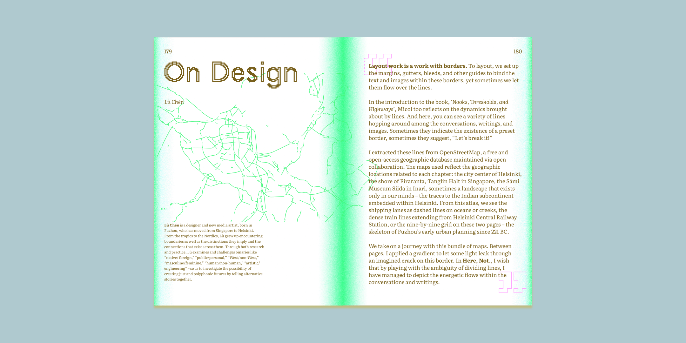
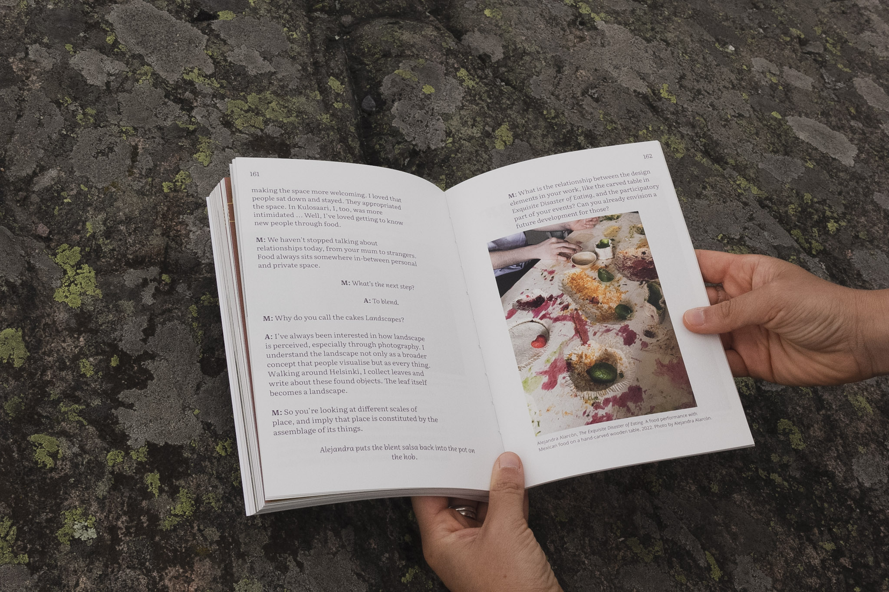
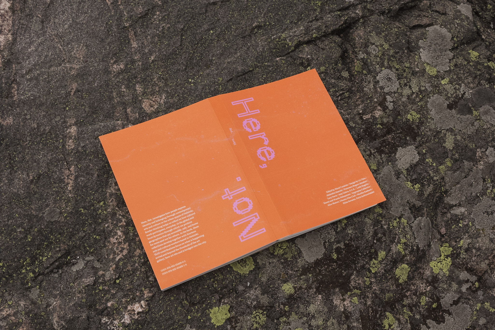

Edited by Micol Curatolo / Design and identity by Lù Chén

## About the Book

🗺 "Here, Not. *Dialogues on art and the making of here*" is an edited collection of conversations, photographic work, and creative writing, that investigate how arts and culture address belonging, identity and access in the urban spaces of Helsinki.

This publication is part of Micol Curatolo's MA thesis project. Thanks to Micol (her inspirations and her trust), I had this opportunity to join this journey with her and experiment with the “boundaries” and “layers” between text and images.

- 📖 Read flipbook online here: [Here, Not.](https://issuu.com/micolcuratolo/docs/pdfa-page--here-not-digital)
- ⏬ [Download the PDF](https://drive.google.com/file/d/1dnd073S2LEEeka9RuBlCZSV3ZX_4q3sc/view)
- 🔗 Online reading on [Tuo Tuo Arts Resource Library >> Community Resources](https://tuotuoarts.com/Resource-Library)

## On Design: Layout and Borders

Layout work is a work with borders.  

To layout, we set up the margins, gutters, bleeds, and other guides to bind the text and images within these borders, yet sometimes we let them flow over the lines. 

We take this journey with a bundle of maps: at the beginning of each chapter, we can find lines that extracted from certain geographic locations. Between page and page, I applied gradient to allow some light to leak through an imagined crack on the border. In Here, Not., I wish that by playing with the ambiguity of dividing lines, I have managed to depict the energetic flows within the conversations and writings. 

## Physical Book Available Now

Find the book at:
- London UK [@lotprojects](https://www.instagram.com/lotprojects/) / [@inbetweenknots](https://www.instagram.com/inbetweenknots/) 18.8.2024
- Helsinki FI [@aaltovicca](https://www.aalto.fi/en/department-of-art/visual-cultures-curating-and-contemporary-art-vicca) / [@hiap_suomenlinna](https://www.instagram.com/hiap_suomenlinna/) 31.8.-1.9.2024 and [@utlbookfair](https://www.instagram.com/utlbookfair/) 7.-8.9.2024
- Tilburg NL [@murfmurw](https://www.instagram.com/murfmurw/) / [@wobbyclub](https://www.instagram.com/wobbyclub/) 29.9.2024

...and maybe more to come <3

## Thanks to...

Contributions by  
- Alejandra Alarcón
- Francesca Bogani Amadori
- Micol Curatolo 
- Lucy Davis
- Amy Gelera (S.U.R.) 
- Lotta Hagelin
- Naomi and Wanda Holopainen
- Impropias Collective (Mercedes Balarezo Fernández, Yes Escobar, Paola Nieto Paredes, Daniela Pascual Esparza)
- Alice Mutoni (Ubuntu Film Club)
- Muniba Rasheed
- Eliisa Suvanto (Porin kulttuurisäätö)

Proofreading by Nastia Svarevska

Supported by Aalto Arts and Aalto Visual Cultures, Curating and Contemporary Art (ViCCA) 

