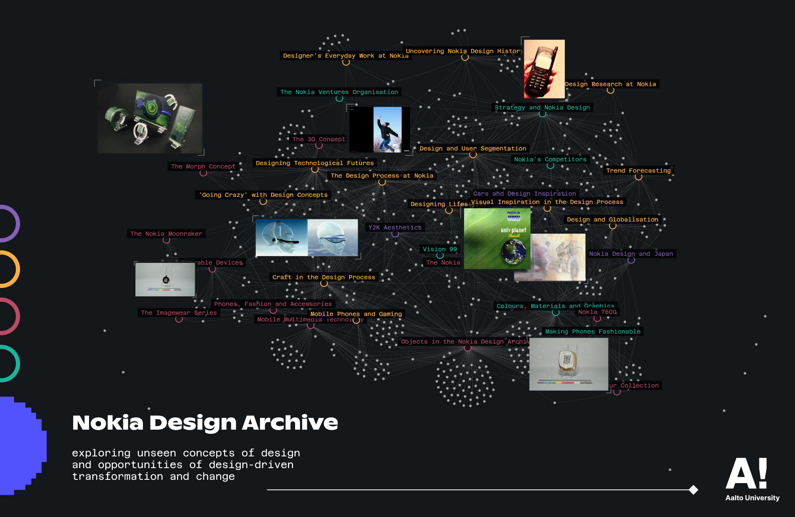

*data visualisation, remediate & represent*

View the archival visualisations:[https://nokiadesignarchive.aalto.fi/](https://nokiadesignarchive.aalto.fi/)

Creators of the site: Lu Chen, Michel Nader Sayún, and Kaisu Savola
With the support from the Nokia Design Archive team and Aalto University Communications

## Remediating Archival Material for Accessible Knowledge

*A preview of the Nokia Design Archive, Image: Lu Chen, Aalto University*

The Nokia Design Archive is a publicly accessible, online digital portal, created as a research project in the Department of Design at Aalto University, Finland. With items donated by Microsoft Mobile Oy and Nokia designers, the research group curated a unique and previously unseen collection to study the history of design and technological development. The collection spans the mid-90s, through Nokia’s heyday, up until 2017 when the brand’s handset operations ended.

The uncurated archive holds over 20,000 entries and over 950GB of digital files. In 2023, the research group decided to create an interactive platform to make the archive more accessible. Thus, I had the opportunity to join the project and develope the interactive visualisation concepts with **Michel** and **Kaisu**. From October to December 2023, we prototyped and tested four interactive visualisations. In the summer of 2024, I continued to revise the interface design and programmed two interactive visualisations and the portal from June to August 2024. Improvements to the portal back-end infrastructure and user experience were deployed from November 2024 until January 2025, with the support from Aalto Communications. The portal was launched to the public on January 15th 2025.

I will be presenting my working experience and process in the [DIGHT-Net workshop: Building the Digital Archive of a Scholar](https://dight-net.tlu.ee/dight-net-workshop-building-the-digital-archive-of-a-scholar/) at Tallinn University on 25 Feburary 2025. After the workshop, my documentation and reflection on the information design process will be uploaded here as well.

## "Digital Dust" (Excerpt from Minna Hölttä's interview on aalto.fi)

For an information designer, visualising Nokia’s archives was a unique challenge. Instead of statistics, the task involved presenting objects, curated collections, metadata, and designers’ stories. We wanted the visualisation to evoke emotions and spark insights in its users.

On Kaisu’s recommendation, I read *Dust* by British historian **Carolyn Steedman**. In physical archives, floating dust can obscure vision. On inhaling the dust of old papers and parchments, historians are reminded of the lived experience connected to the manuscripts. In the digital world, the equivalent of dust is the fragmentation of reality, which always leaves something hidden from its users. Every collection acts as a lens or perspective rooted in a particular moment, helping future users to see through the eyes of the researchers — and inspiring them to discover the archive through the lens of their own interests.

**Read the full article here:** Minna Hölttä, (2025, January 15). “Left outside in the rain”: The story behind the stories of the Nokia Design Archive. Aalto University. [https://www.aalto.fi/en/news/left-outside-in-the-rain-the-story-behind-the-stories-of-the-nokia-design-archive]