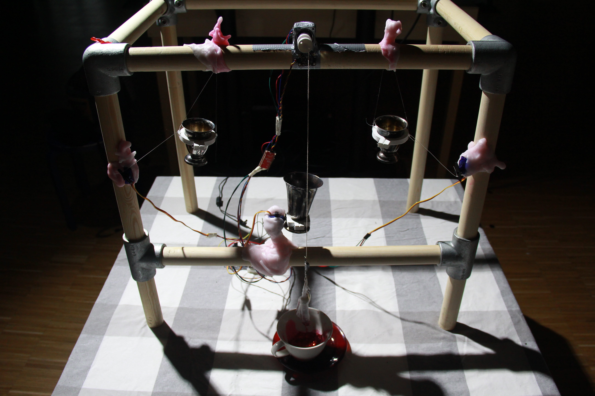

## Unpack the Binary

“…Technology has begun to make creating easy enough that *everyone* can make,” said Mark Hatch (2013) in the Maker Movement Manifesto. It sounded convincing: in 2009, the Fused Deposition Modelling (FDM) printing process patents expired, which led to the booming development of affordable FDM 3D printers. With the rise of open-source initiatives, tools for 3D printing and some other industrial-level manufacturing processes are now accessible for schools, community workshops, and individual consumer-makers. At the beginning of the 2000s, the enthusiastic call for “making” seemed to promise us an empowering future where creativity would be democratised, and innovations could happen anywhere. 

Such a vision implied unprecedented educational opportunities to enable *everyone* to “make (almost) anything,” as described in the MIT 6.943 course title. Nevertheless, instead of *everyone*, the composition of the maker community nowadays is still relatively homogenous: primarily men, with a background in electronics or engineering. The lack of diversity in the maker scene, from the maker representation to the types of projects being made, remains a critical issue of the maker culture. 

Existing critiques have identified several persisting forms of exclusion in the maker culture, including gender, class, race, and age. Yet, when attempting to remedy the asymmetries, especially regarding the gender gap, maker initiatives tend to construct their countermeasures with binary oppositions, such as “male/female,” “technical/artistic,” or “to make/to craft.” The dichotomous thinking often fails to address the problem but risks reinforcing the stereotypes and sustaining the power dynamics as the status quo. 

Here, I would like to adopt queering as a praxis to examine and challenge the norms at the maker scene. The following discussion will focus on three elements regarding the making: *gender*, *labour*, and *machine*. The linkage between these elements is our tendency to oversimplify complex subjects with binary notions: the sex-based understanding of gender (male/female), the categorisation of productive and unproductive labour in management, the distinction between machines and organisms, and many other dichotomies. 

Through the lens of queer theory, we recognise *gender* as a social construct. Not simply a “biological reality,” gender functions as an identity marker that needs to be embodied performatively through repeated actions. With this understanding, we will notice the actual oddity or “queerness” in treating gender as the determining factor of a maker’s interests or capabilities, and thus realise other factors contributing to gender-based social inequality. 

The heteronormative ideology has also influenced our perceptions of *labour*. We have to admit that certain works are more celebrated in makerspaces. “Making,” especially the technical making, and its knowledge, are easily recognised and valued. Meanwhile, the labours that form the infrastructure of making are often deprioritised, which include but are not limited to caregiving, education, and community maintenance. (Un)surprisingly, this view on productivity and values reflects the patriarchal narratives of gendered labour. 

Lastly, we should explore the tension between humans and *machines* at the technology-oriented workshops. There exist (at least) two images of machine: one portrays a powerful (and fearful) object with precise and consistent performance, while the other one depicts a much less perfect or reliable being with some “mysterious” quirks in its way of working. The contradicting facets led us to question the idea of “objectivity” endorsed by the techno-patriarchal tenets, and further speculate the making of futures based on our (symbiotic) relations with the machines and the materials involved in our making.  