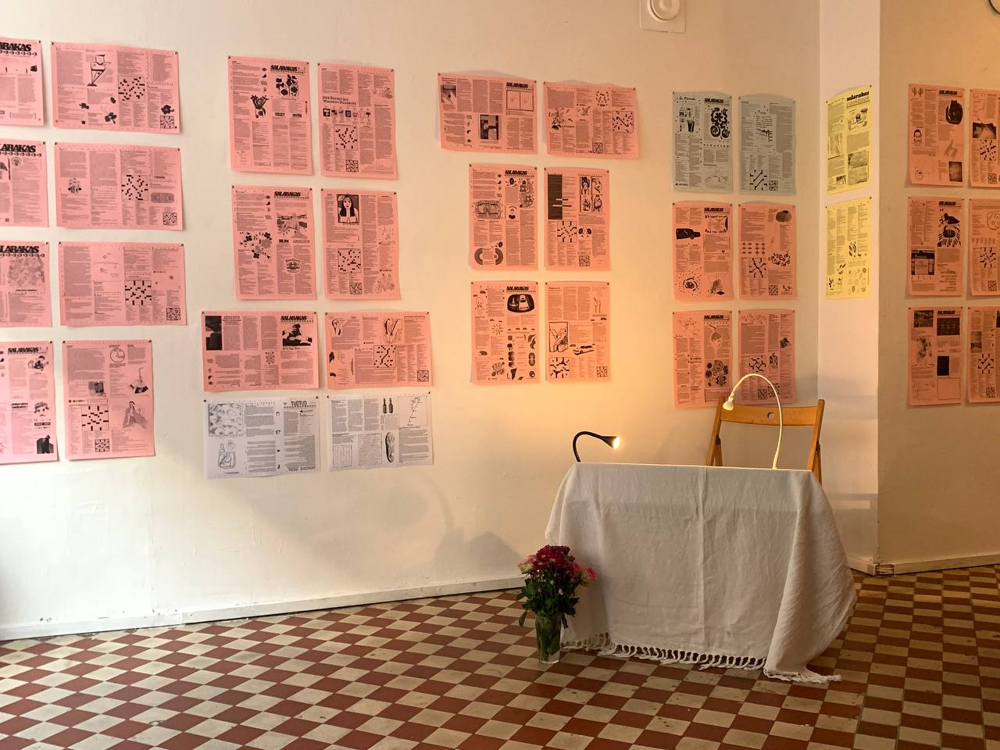
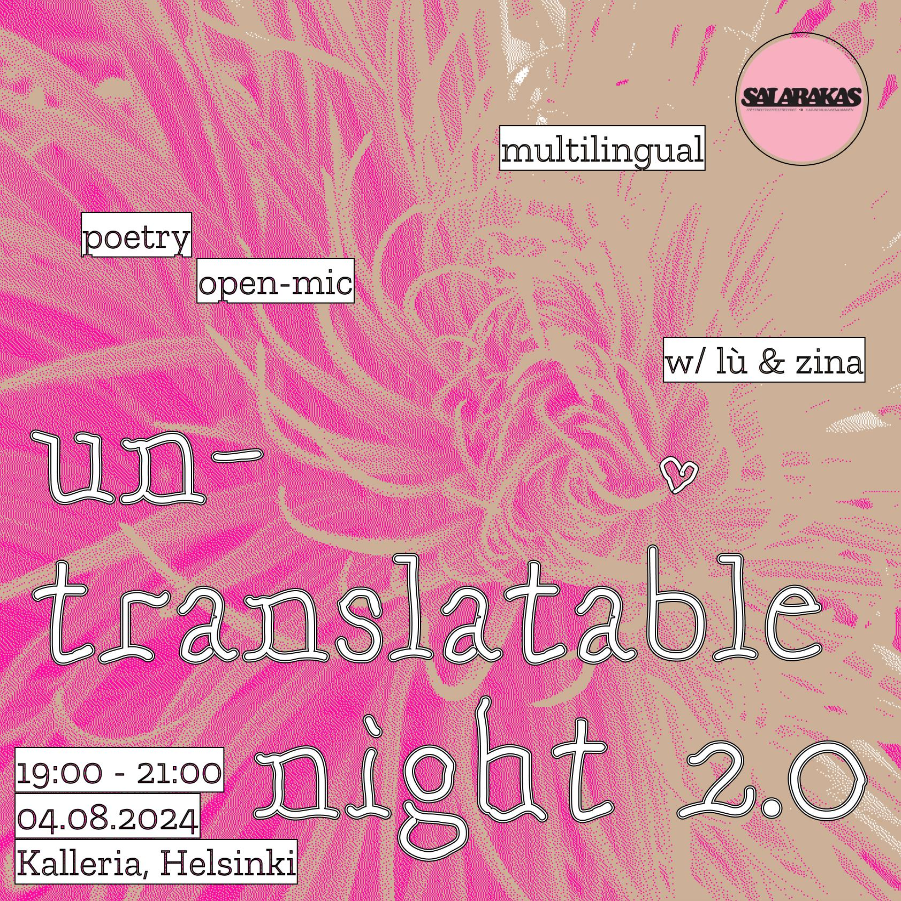
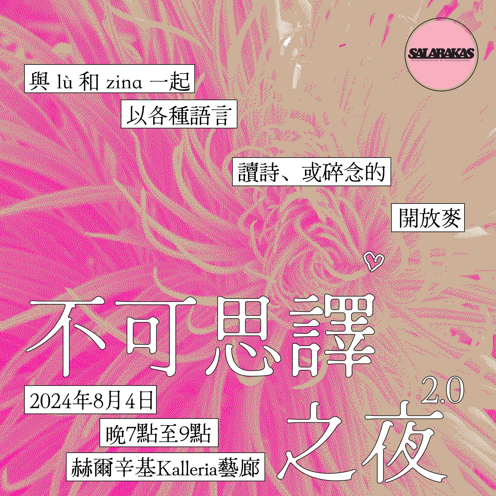
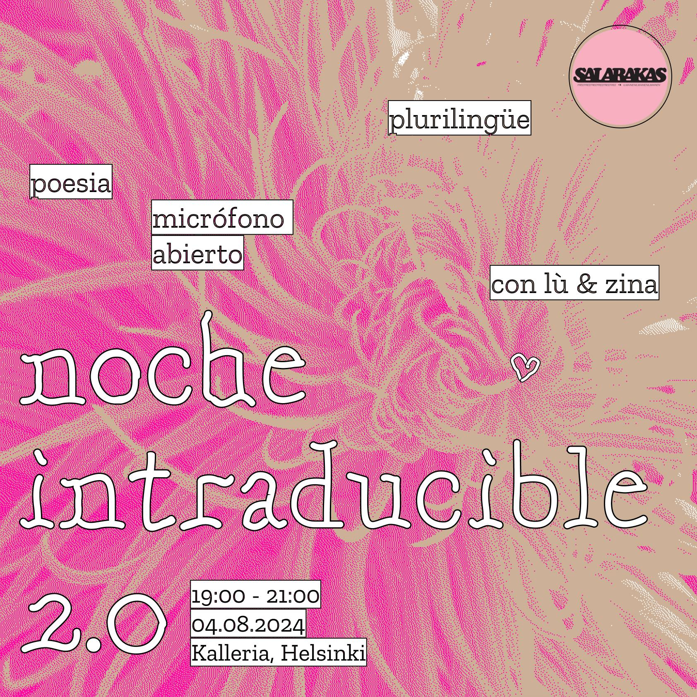

Co-host by Lù & Zina, special thanks to D.I.O space, Salarakas, Kalleria, and Jonna Eloranta (for all the inspiration and support).

*The setup of Untranslatable Night 2.0 at Galleria Kalleria, for Salarakas' 4th Anniversary*

## The Invitation

🌌*We invite you to come and share an evening of (possible) misunderstandings*

📝*Bring with you a part of, a full piece of poetry or any written work in your language(s) that you wrote or that speaks to you*

💬*We will give space for everyone to read the text they bring in their mother tongues.*

✨*You are welcome to come and just listen as well.*

💕*These will not be translated since we hope that those present interpret the words and language in its emotional, untranslated state.*

