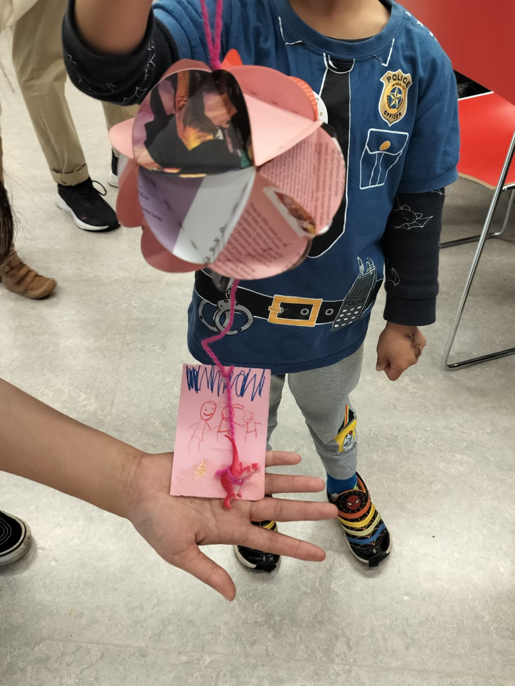

*Art & Craft Workshop for Children, organised with [Burak Türköz](https://burakturkoz.gitlab.io/design-portfolio/) for [Kolibrí Festivaali](https://www.kolibrifestivaali.org/) 2025*

*A child holding a finished lantern, photographed by Burak Türköz*

## Why are we making lanterns?

**A Lantern for Wishes** is an art and craft workshop at Sello Library, Espoo, organised by [Burak Türköz](https://burakturkoz.gitlab.io/design-portfolio/) and I (Lù Chén) for [Kolibrí Festivaali](https://www.kolibrifestivaali.org/) 2025.

The theme of Kolibrí 2025, its 10th anniversary, is "Wishes." Talking about “wish,” we thought about the Chinese paper lantern. We set them to the water and sky for wishes, often with writings or drawings on the paper. This mesmerising cultural object also flies across oceans - using lanterns for prayers and wishes has been a long-established practice across cultures. We can find the practices of making paper lanterns in Japan, Thailand, Brazil, Mexico, and more.

Hence, we invite the children and their families to make paper lantern together, and then decorate them with “amulets” that represent their past or future wishes. 

Our workshop information on Kolibrí website is linked here: [https://www.kolibrifestivaali.org/event/a-lantern-for-wishes/](https://www.kolibrifestivaali.org/event/a-lantern-for-wishes/)

## It was a workshop with around 300 dinosaurs - a big thank you to all the material donations and support!

*Materials on the workshop table, photographed by Burak Türköz*

For this workshop, we want to demonstrate that making does not necessarily require expensive materials - sometimes, you can utilise the things that are just lying around in your home! For example, we used old magazines, flyers, and posters to cut out all the colourful paper circles. Other than that, we started asking through social circles if anyone has unneeded craft materials or small amulets for giveaway. And here, you can see all the amazing materials we had for the workshop - especially the hundreds of dinosaurs!

*Dinosaurs and other decoration items, photographed by Burak Türköz*

Thanks to Nat, Mónica, Anh, Betsy - for warmly sharing with us all the materials, without your help, this workshop would not be as fun as it was.

Thanks to I-Wen and Maija, our festival volunteers, for their kindest help in organising the workshop and assisting the attendees.

And, many thanks to Sello Library Paja (the makerspace) and Ninho ry.

## Make It Yourself!

Below is an illustrated tutorial created by Burak Türköz and me. Orginally for the multi-lingual workshop, however, it can also be used as a DIY guide for one to make lanterns on their own! The tutorial consists five images in total, the first one presents an overview of the necessary materials.

If you are interested in using laser cut machine to cut the circles, you may find relevant facilities in public libraries:
- **Oodi Libary** (Helsinki): [https://varaamo.hel.fi/en/search?textSearch=laser](https://varaamo.hel.fi/en/search?textSearch=laser)
- **Iso Omena Library** (Helsinki): [https://varaamo.espoo.fi/search?search=laser](https://varaamo.espoo.fi/search?search=laser)
- **Lumo Library** (Vantaa) - "electronic cutting machine": [https://www.vantaa.fi/en/leisure-and-recreational-activities/library-services#tab-anchor-reservable-premises-and-devices-](https://www.vantaa.fi/en/leisure-and-recreational-activities/library-services#tab-anchor-reservable-premises-and-devices-)

Nevertheless, it is important to remind ourselves again that digital fabrication is *NOT* the only way to *MAKE* things. Cutting (with scissors), tearing, sewing, glueing - we can always exercise our crafts <3

*A child proudly showcasing the lantern and a drawing of family, photographed by Burak Türköz*

## Some Other Resources
- **A total beginner's learning diary of laser cutting** by Lù in 2024: [https://l-lu-u.gitlab.io/2024-digital-fabrication/weekly-assignments/week-05](https://l-lu-u.gitlab.io/2024-digital-fabrication/weekly-assignments/week-05/)
- **Makerspaces in Espoo City Library** by Eun Young: [https://www.espoo.fi/en/culture-and-leisure/libraries/makerspaces-espoo-city-library](https://www.espoo.fi/en/culture-and-leisure/libraries/makerspaces-espoo-city-library)
- **Makerspace visit (2): Iso Omena library paja in Espoo** by Eun Young: [https://makingmakerspace.wordpress.com/2018/04/10/makerspace-visit-2-iso-omena-library-paja-in-espoo/](https://makingmakerspace.wordpress.com/2018/04/10/makerspace-visit-2-iso-omena-library-paja-in-espoo/)
- **"comb-test made easy" a tool for making press-fit design** by Lù in 2024 based on Nadieh Bremer's documentation: [https://cuttle.xyz/@lu_u/comb-test-made-easy-9knZ2wZeQKZM](https://cuttle.xyz/@lu_u/comb-test-made-easy-9knZ2wZeQKZM)