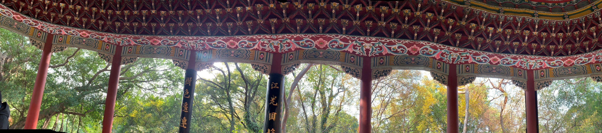
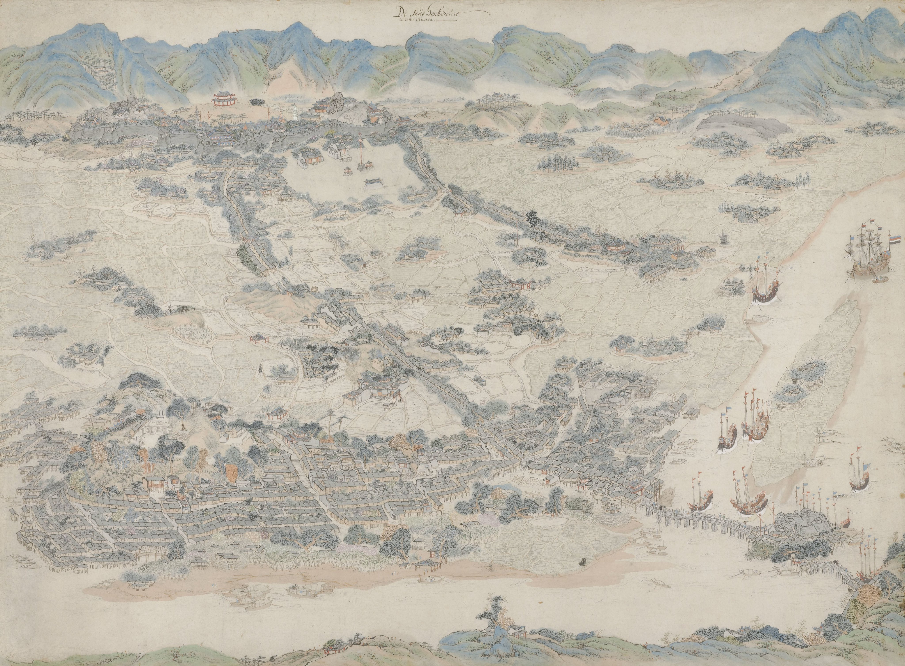
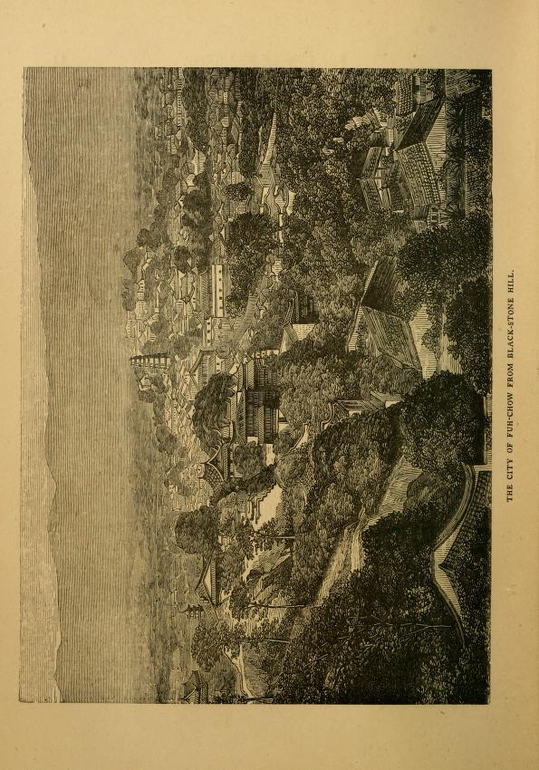

*panoramas in Fuzhou and the city of Fuzhou in digital archives*

## Raree-Landscape: Panning across the Space and Time

*Figure 1. A panorama of a pavilion’ interior, photographed by Lù on January 1, 2025.*

The pillars visible in the panorama, are part of a pavilion, *Daoshan Ting* [Chinese: 道山亭; Pinyin: Dào Shān Tíng, meaning ‘Pavilion of Tao Hill’]. The text on the pillars are two lines of a poem written by an early 18th century literatus Xu Ding [Chinese: 许鼎; Pinyin: Xú Dǐng]. The poem reads: 

> ‘江光回抱千峦迥，树色遥连万井阴。’ 
> [Shining river waves embrace the thousands of mountains near and far;
> Tree shadows stretch into the distance, linking countless houses.]

Written before the invention of photography, these fourteen words guide us into a panoramic journey —traversing the landscape from the river afar to the woods right in front —entirely through the medium of text. 

Perhaps, portraying panoramic landscape was always an interest of Chinese literati. In the preface of *Linquan Gaozhi* [Chinese: 林泉高致; Pinyin: Lín quán gāo zhì, meaning ‘The Lofty Message of Forests and Streams’], landscape painter Guo Si [Chinese: 郭思; Pinyin: Guō Sī] wrote that a mountain would appear differently with every step the viewer takes. By observing a good shan shui painting, one can travel spiritually admist the mountains and rivers. Hence, classical Chinese landscape paintings often reflect the wandering path of viewpoints. Objects are not necessarily positioned following their spatial relations, rather, they are arranged and rendered deliberately to represent the painter’s mindscape. 

Like how I spun in the pavilion to capture all the pillars.

The pavilion was originally built in the year 1068, under the command of Cheng Shi-Meng [Chinese: 程师孟; Pinyin: Chéng Shī Mèng], the local governor of Fuzhou. Upon the visit to this site, Cheng Shi Meng felt the surrounding scenery resembled the depiction of Taoist wonderland and thus renamed the hill from Wu Shan [乌山; Pinyin: Wū Shān, meaning ‘Crow Hill’] to Dao Shan [Chinese: 道山; Pinyin: Dào Shān, meaning ‘Tao Hill’]. Indeed, throughout the following hundreds of years, this mountain gradually attracted Taoist and Buddhist priests to set up temples or reside for seclusion practices.

For anyone who is less familiar with Chinese late modern history, the name Fuzhou sounds distant. In older *Western* publications, this city was varyingly romanized as *Foochow*, *Foo-chow*, *Fuhchau*, *Hokchew*, *Hock Chew*, and more. By searching any of the abovementioned alternative romanizations, one may realize that this remote Far East city is surprisingly present in museum and archival collections in the West.  

For example, the Rijksmuseum—the national museum of the Netherlands—houses a map of Fuzhou dated approximately between 1670 and 1700. Measuring 121 centimeters in height and 157 centimeters in length, the map provides a detailed illustration of the harbor near the Nantai Island, the vast farmlands, the walled inner city, and the mountainous landscape surrounding Fuzhou. On the right side of the map, a Dutch ship appears just off the coast. In the late seventeenth century, the Qing dynasty began to gradually lift the centuries-long ban on maritime trade. The Dutch East India Company (VOC) thus sent several envoys to China, hoping to gain permission to establish trading posts on the mainland—including in the coastal city Fuzhou. 

*Figure 2. A map illustrating the bird-eye view of Fuzhou, stored in the Rijksmuseum.*

The identity of the drafter remains unknown. Was the map drawn by a foreign surveyor or a local artist? Still, one can sense that the landscape here was rendered differently than the classical shan shui paintings. For this watercolor map, perspective drawing techniques were effectively applied to create the depth of the space. When viewing this map, we gaze through a fixed, elevated viewpoint that reaches the very end of the city below. In the upper left quadrant, a black tower stands among the trees—marking the location of *Dao Shan*.

The Internet Archive holds a digitized copy of *The Wu Shih Shan Trial* (1879), referring to this same site—Wu Shih Shan, or ‘Black-Stone Hill,’ another name for Dao Shan. Contributed by the University of California Libraries, this file reproduces a legal case from the late 19th century, documenting a conflict between the local gentry of Fuzhou, Protestant missionaries, and the British consulate. After the First Opium War (1839–1842), Fuzhou was opened as a treaty port under the condition of the Treaty of Nanjing. Since then, more than 17 countries had gradually established their consulates in Fuzhou. By the 1850s, only consular officers were permitted to reside within the walled city. For instance, Daoshan Guan [Chinese: 道山观; Pinyin: Dào Shān Gùan], a Taoist temple on Wu Shih Shan was used to host the interpreter of the British consulate. In June 1850, Robert David Jackson and William Welton, two missionaries from the English Church Missionary Society (CMS) intended to rent rooms from another temple on Wu Shih Shan. The rental arrangement was confronted by the local gentry and Chinese officials including the ex-commissioner Lin Zexu (see Note 1.), while the missionaries seek assistance from the British consulate to secure their premises. By the end of 1851, this dispute was ended with the province governor Xu Jiyu offering the two missionaries to live in the Daoshan Guan with the interpreters. And thus, Fuzhou became the first Chinese treaty port that allowed missionaries to reside within the inner city.

Nevertheless, this agreement did not fully resolve the tension between the locals and the foreigners but foreshadowed a more severe conflict in 1878. From 1876 until 1878, another two CMS missionaries, John Richard Wolfe and Robert Stewart had been building a girl’s school and a few dormitories inside the Daoshan Guan compound. The construction caught the attention of the local gentry again, as some started speculating these *Western* facilities built on the hill had affected the Feng Shui of the Fuzhou city and thus resulted in the flooding in 1876. In the afternoon of August 30, 1878, a few people broke into the temple and burnt down the three newly constructed buildings. After this violent conflict, the missionaries were finally relocated away from the walled city of Fuzhou.

*Figure 3. An engraving included in Eugene Stock’s book The Story of the Fuh-Kien Mission of the Church Missionary Society (1877), depicting the city of Fuzhou from Black-stone Hill (or Wu Shih Shan).*

The determination of CMS missionaries to stay on this hill may appear strange. In a letter written upon his arrival at Fuzhou in 1863, John Richard Wolfe described a similar scenery to Xu Ding’s poem, and further explained what this location meant for the mission:

> *‘… The whole city is seen from our door (see Note 2), so that we can never go out or come in without being reminded of the vastness of our work, and our own want of strength to accomplish it.’*

*Vastness.* Similar to the map stored in the Rijksmuseum, these images of Fuzhou seem to always carry the passionate gaze from the ambitious foreign surveyors towards the *exotic* project before their eyes. This attitude may remind us of Said’s description in *Orientalism* —to get hold of the ‘whole sprawling panorama’.